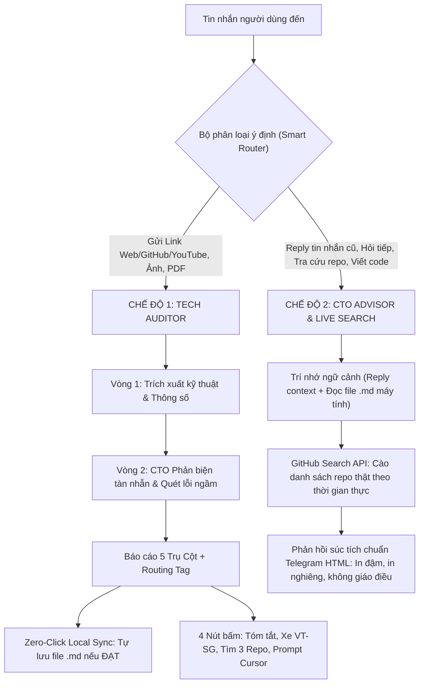

# 00 — PROJECT MASTER CONTEXT: VIBECHECK AI (v3.0 ULTRA)

> [!IMPORTANT]
> **Tuyên ngôn cốt lõi**: "Business first. ROI before complexity. Zero-Cost operations."
> VibeCheck AI không phải là chatbot đàm thoại giải trí, mà là một **Máy lọc rác công nghệ, Hội đồng Phản biện Tự động (Reflexion) & CTO Thực Chiến Bỏ Túi**, chuyên bóc tách bản chất công nghệ, vạch trần hype, đàm thoại ngữ cảnh linh hoạt, tự rà soát điểm mù và đề xuất phương án tối ưu vượt trội cho mọi bài toán kinh doanh.

---

## 1. THÔNG TIN HỆ THỐNG
* **Thư mục dự án**: `C:\Users\Admin\Documents\EKS Knowledge OS\01_Projects\Bot_Tham_Dinh_AI`
* **File thực thi chính**: `bot_auditor.py` (v3.0 Ultra Universal Reflexion)
* **File khóa đơn tiến trình**: `bot.lock` (Tự động diệt tiến trình treo, chống lỗi 409 Conflict)
* **File bảo mật môi trường**: `.env` (Ẩn Token và API Key)
* **Script khởi động thông minh**: `run_bot.bat` (Tự kiểm tra Python, cài đặt thư viện & Watchdog tự phục hồi)
* **Thư mục lưu trữ khảo sát**: `Khao_Sat_Cong_Nghe/`
* **Telegram Bot Handle**: `@thamdinh_ai_bot`
* **Tên hiển thị Telegram**: `VibeCheck AI | CTO Thực Chiến`
* **Model AI Cascade**: `gemini-3.5-flash-lite` ➡️ `gemini-3.5-flash` ➡️ `gemini-flash-lite-latest` ➡️ `gemini-3.7-flash` (100% Free Tier, tự xoay tua chống lỗi 429/503)

---

## 2. KIẾN TRÚC HOẠT ĐỘNG 2 CHẾ ĐỘ (DUAL-MODE ARCHITECTURE)

---

## 3. KHÓA CHẶT VÀO 5 TRỤ CỘT KINH DOANH
1. 🚗 **Dịch vụ Xe Du Lịch & Web Booking (Tuyến Vũng Tàu ↔ Sài Gòn / Sân bay & Đi tỉnh)**:
   - Bản chất: Xe gia đình 7 chỗ Mitsubishi Xpander, đưa đón tận nơi/tận nhà, xe tiện chuyến, hợp đồng đi tỉnh.
   - Mục tiêu sống còn: Xây dựng hệ thống **Direct Booking** (Web, Zalo, Hotline) để giảm tối đa phụ thuộc vào môi giới cắt phế (50k-100k/cuốc).
   - Nguyên tắc: 0 ĐỒNG hoặc chi phí cực thấp, không vẽ vời hạ tầng phức tạp.
2. ⚡ **Vibecoding**: Lập trình tốc độ cao, Cursor, Python/Node, tạo MVP siêu tốc.
3. ✍️ **Content & SEO thực chiến**: Kéo khách tự nhiên từ Google Search.
4. 💼 **Đóng gói B2B**: Giải pháp cho doanh nghiệp.
5. 🎬 **Video thực tế chuyển đổi cao**: Short-form, TikTok, Reels.

---

## 4. QUY CHUẨN ROUTING TAGS
* `[TRIỂN KHAI NGAY]`: Giá trị cao, chi phí hợp lý, phục vụ trực tiếp bài toán kinh doanh, sẵn sàng làm MVP. -> **Tự động lưu file vào máy**.
* `[LƯU THAM KHẢO]`: Công nghệ tốt nhưng cần theo dõi thêm hoặc chưa khớp nguồn lực. -> **Tự động lưu file vào máy**.
* `[BỎ QUA/HYPE]`: Chiêu trò marketing, rủi ro cao, không mang lại dòng tiền. -> **Không lưu file để tránh rác ổ cứng**.
